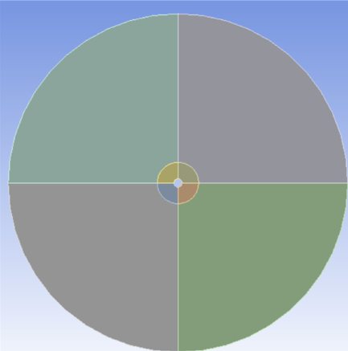
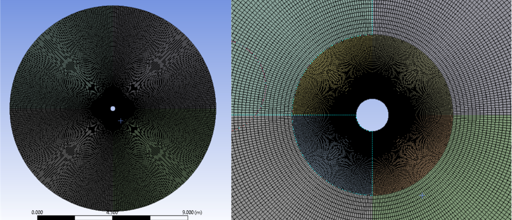
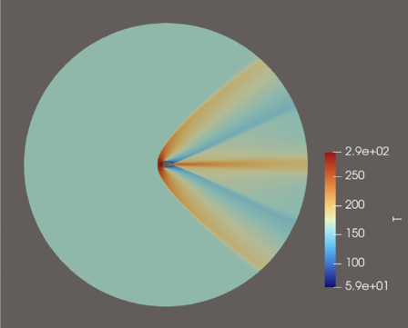
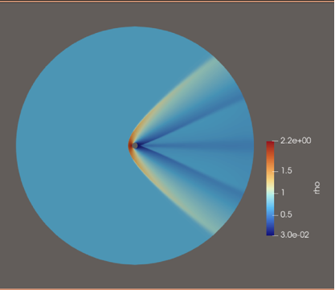
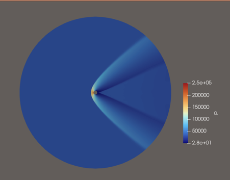
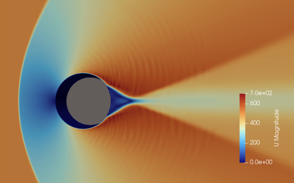
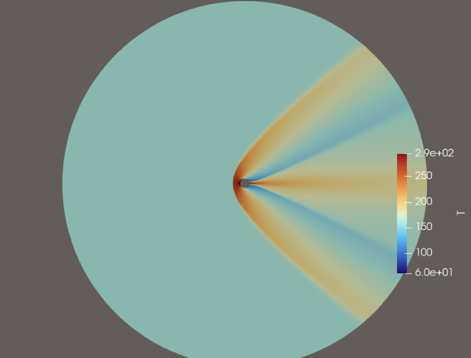
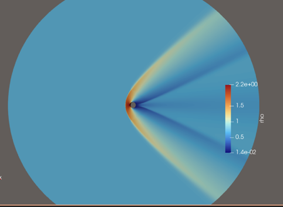
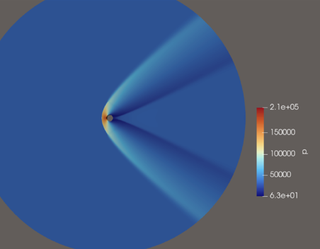
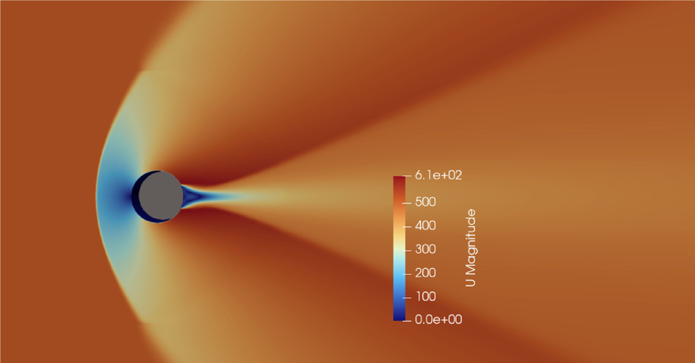

# Supersonic Flow Over a 2D Cylinder — Shock Standoff Distance (OpenFOAM)

Compressible CFD simulation of Mach 2 flow over a 2D cylindrical blunt body, validating the predicted bow shock standoff distance against Billig's empirical correlation.

---

## 1. What this project does

At supersonic speeds, flow cannot "warn" a blunt body of its presence acoustically, so it must decelerate and turn abruptly through a detached bow shock standing off the leading edge. The distance between the shock and the body along the stagnation streamline — the **shock standoff distance, δ** — is a classic, well-documented benchmark for validating that a compressible CFD solver correctly captures shock strength, total pressure loss, and stagnation conditions.

This project simulates that flow field for a 2D cylinder at Mach 2 using OpenFOAM's density-based compressible solver `rhoCentralFoam`, and compares the simulated standoff distance against Billig's correlation — a widely used empirical fit for hypersonic/supersonic blunt-body shock standoff distance:

$$\frac{\delta}{R} = 0.386 \, e^{\left(\frac{4.67}{M^2}\right)}$$

The study also compares two spatial interpolation schemes (1st-order Upwind vs. 2nd-order Van Leer) to look at how numerical scheme choice affects shock-capturing accuracy.

---

## 2. Case setup

| Aspect | Value |
|---|---|
| Geometry | 2D cylinder, radius = 0.1594 m |
| Domain | Circular far-field domain, diameter = 6.3048 m (≈ 40 × body diameter) |
| Mesh | Unstructured, ~96,000 elements, generated in ANSYS Fluent, with anisotropic refinement in the anticipated shock-standoff region and near-wall boundary layer |
| Freestream Mach number | M = 2 |
| Solver | `rhoCentralFoam` (density-based, compressible Navier–Stokes + energy) |
| Shock-capturing scheme | Kurganov–Tadmor (KT) central-upwind, Godunov-type — no artificial viscosity needed |
| Temporal approach | Unsteady RANS (URANS) — flow evolved transiently to a steady shock topology |
| Turbulence model | RAS (Reynolds-Averaged Simulation), Favre-averaged for compressibility |
| CFL number | 0.4 |
| Interpolation schemes compared | 1st-order Upwind, 2nd-order Van Leer |

**Boundary conditions:**

| Patch | Velocity | Pressure | Temperature |
|---|---|---|---|
| Inlet | fixedValue | fixedValue | fixedValue |
| Outlet | zeroGradient | zeroGradient | zeroGradient |
| Cylinder wall | noSlip | zeroGradient | zeroGradient |
| Front & back planes | empty | empty | empty |

Freestream static conditions were derived from target stagnation properties using standard isentropic relations for a calorically perfect gas (γ = 1.4):

$$T_0 = T\left(1 + \frac{\gamma-1}{2}M^2\right), \qquad
P_0 = P\left(1 + \frac{\gamma-1}{2}M^2\right)^{\frac{\gamma}{\gamma-1}}$$

---

## 3. Mesh




The domain is split into zones to allow denser element clustering near the cylinder and in the expected bow-shock region, while keeping the far-field boundary coarse and far enough away to avoid reflected-wave contamination of the shock solution.

---

## 4. Results

### 4.1 Van Leer scheme (2nd order)

<p align="center">
<br>
<em>Temperature (K) — bow shock visible as the hot fan ahead of the cylinder</em>
</p>
<p align="center">
<br>
<em>Density (kg/m³)</em>
</p>
<p align="center">
<br>
<em>Pressure (Pa)</em>
</p>
<p align="center">
<br>
<em>Velocity magnitude (m/s), close-up — shock standoff gap clearly visible ahead of the cylinder</em>
</p>

| Quantity | Theoretical (Billig) | Simulated | Relative error |
|---|---|---|---|
| Shock standoff distance, δ | 0.208 m | 0.189 m | 9.1% |

### 4.2 Upwind scheme (1st order)

<p align="center">
<br>
<em>Temperature (K)</em>
</p>
<p align="center">
<br>
<em>Density (kg/m³)</em>
</p>
<p align="center">
<br>
<em>Pressure (Pa)</em>
</p>
<p align="center">
<br>
<em>Velocity magnitude (m/s), close-up</em>
</p>

| Quantity | Theoretical (Billig) | Simulated | Relative error |
|---|---|---|---|
| Shock standoff distance, δ | 0.208 m | 0.222 m | 6.7% |

### 4.3 Interpretation

Both schemes recover a distinct, correctly-shaped detached bow shock, with the expected stagnation-point temperature/pressure/density rise and shock-layer structure visible in every contour. Both land within roughly 7–9% of the Billig correlation, which is a reasonable result for a 2D inviscid-dominated blunt-body benchmark at this mesh resolution.

One result worth calling out honestly rather than glossing over: **the 1st-order Upwind scheme (6.7% error) came out slightly closer to the theoretical value than the 2nd-order Van Leer scheme (9.1% error)** — which is the opposite of what's typically expected, since higher-order schemes are generally less numerically diffusive and should resolve the shock more sharply. A few plausible explanations worth investigating further:
- Upwind's extra numerical diffusion may be *smearing* the shock in a way that happens to shift its apparent captured location closer to the empirical correlation for this particular mesh density — i.e. a partially compensating-errors effect rather than genuinely higher accuracy.
- The mesh may not yet be fine enough in the standoff region to let the Van Leer scheme's theoretical accuracy advantage show through — a mesh refinement study (checking whether δ converges as resolution increases) would clarify this.
- Billig's correlation itself is an empirical fit with its own scatter/uncertainty band, so a few percent difference between schemes may simply be within the correlation's own accuracy envelope.

Rather than picking whichever number looks better, the honest read here is that **both schemes are in the right ballpark, the difference between them is small enough that it may not be statistically meaningful without a mesh-independence study**, and a next step worth doing (see Section 6) would be to refine the mesh and re-check whether the ordering between schemes flips — that would confirm or rule out the compensating-error explanation above.

---

## 5. Repository structure

```
.
├── README.md
└── results/
    ├── domain_and_mesh_zones.png
    ├── mesh_full_view.png
    ├── vanleer_temperature.png
    ├── vanleer_density.png
    ├── vanleer_pressure.png
    ├── vanleer_velocity_standoff_closeup.png
    ├── upwind_temperature.png
    ├── upwind_density.png
    ├── upwind_pressure.png
    └── upwind_velocity_closeup.png
```

---

## 6. Limitations & possible extensions

- Only a single mesh density (~96,000 elements) was used — a mesh convergence/independence study (as was done for the FEA project) would strengthen confidence that the 6.7–9.1% error against Billig's correlation reflects physical/numerical modeling limits rather than under-resolution, and would help explain the Upwind-vs-Van-Leer ordering noted above.
- Only Mach 2 was studied — sweeping Mach number and comparing the full trend against Billig's correlation curve (rather than a single point) would be a stronger validation.
- RAS/URANS turbulence modeling is used; the flow features here (shock layer, near-wall boundary layer) are dominated by inviscid shock physics, so turbulence modeling choice is a secondary factor for this specific metric, but would matter more for wall heat flux or drag predictions.
- Billig's correlation itself is an empirical curve fit with a known valid Mach-number range and body-shape assumptions (originally developed for hypersonic axisymmetric bodies, later extended/used for 2D cases) — it's a good sanity-check benchmark, not an exact solution.

## 7. Tools used

| Tool | Purpose |
|---|---|
| ANSYS Fluent (Meshing) | Unstructured mesh generation (~96,000 elements) |
| OpenFOAM (`rhoCentralFoam`) | Compressible, density-based flow solver |
| ParaView | Field visualization (temperature, density, pressure, velocity contours) |

This repository documents the methodology and results of the study; OpenFOAM case files are not included."
